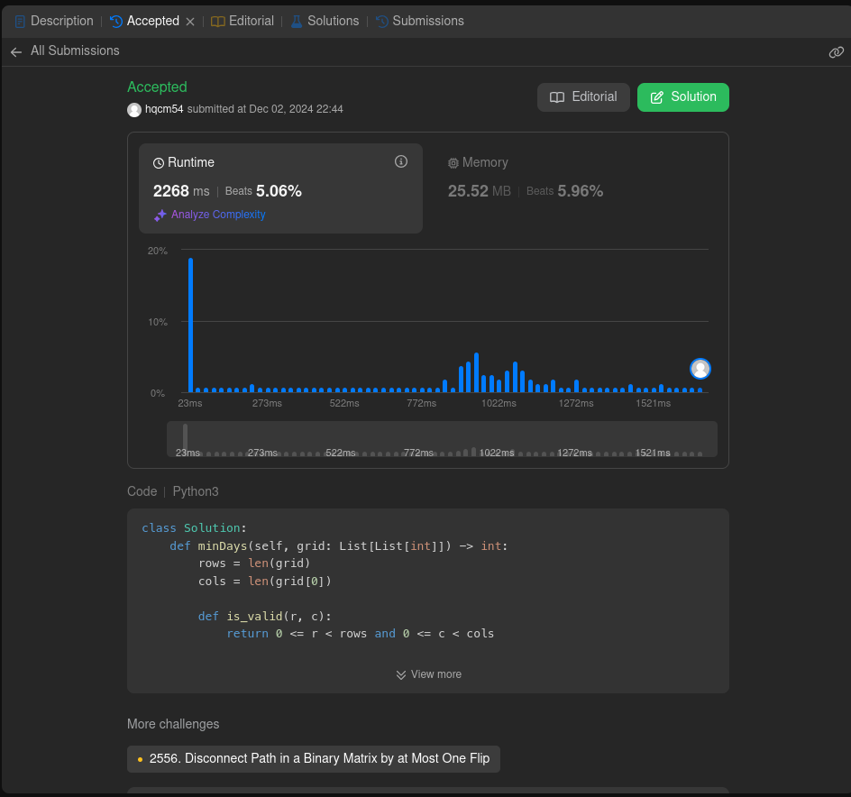
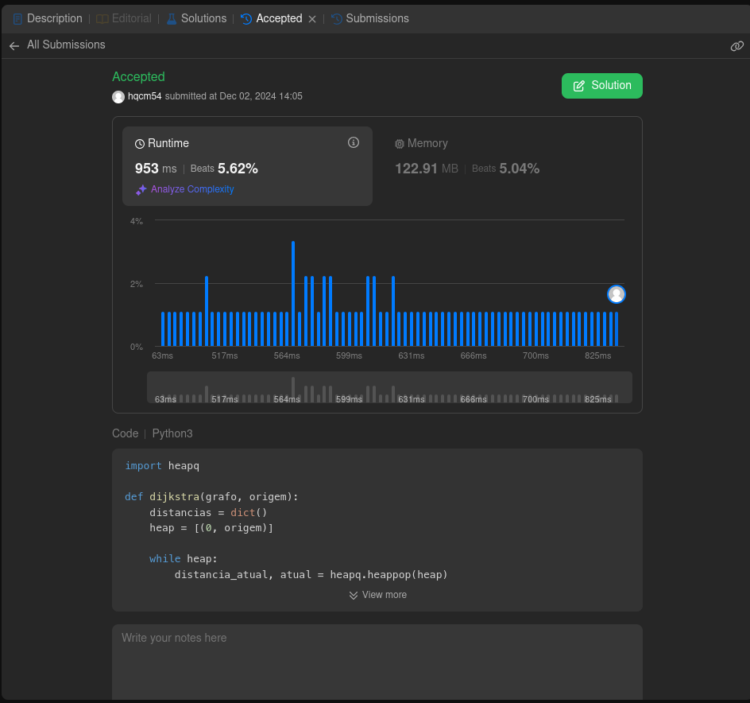
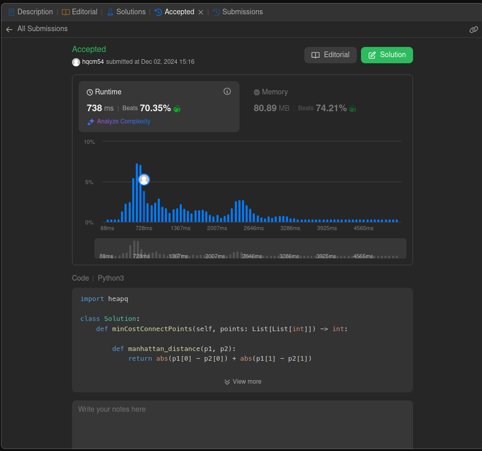

# Grafos2 - Leet Code

**Número da Lista**: 66 
**Conteúdo da Disciplina**: Grafos 2 

## Alunos
|Matrícula | Aluno |
| -- | -- |
| 221022248  | Carlos Eduardo Mota Alves |
| 221021993  | Hugo Queiroz Camelo de Melo |

## Sobre 
Este projeto foi desenvolvido como parte da disciplina Projeto de Algoritmos. A dupla responsável por este projeto resolveu três questões no LeetCode, com o objetivo de aplicar e aprimorar conceitos de algoritmos e estrutura de dados.

## Screenshots

## Instalação 
**Linguagem**: Python3 

Antes de rodar o projeto, certifique-se de que você tem o Python instalado em sua máquina.

## Uso 

- Acesse os links das questões no LeetCode:
   - [Minimum Weighted Subgraph with the Required Paths](https://leetcode.com/problems/minimum-weighted-subgraph-with-the-required-paths/description/)
   - [Min Cost to Connect All Points](https://leetcode.com/problems/min-cost-to-connect-all-points/description/)
   - [Minimum Number of Days to Disconnect Island](https://leetcode.com/problems/minimum-number-of-days-to-disconnect-island/description/)

## Vídeo 

[https://www.youtube.com/watch?v=AHNiYdvSUwc](https://www.youtube.com/watch?v=AHNiYdvSUwc)
